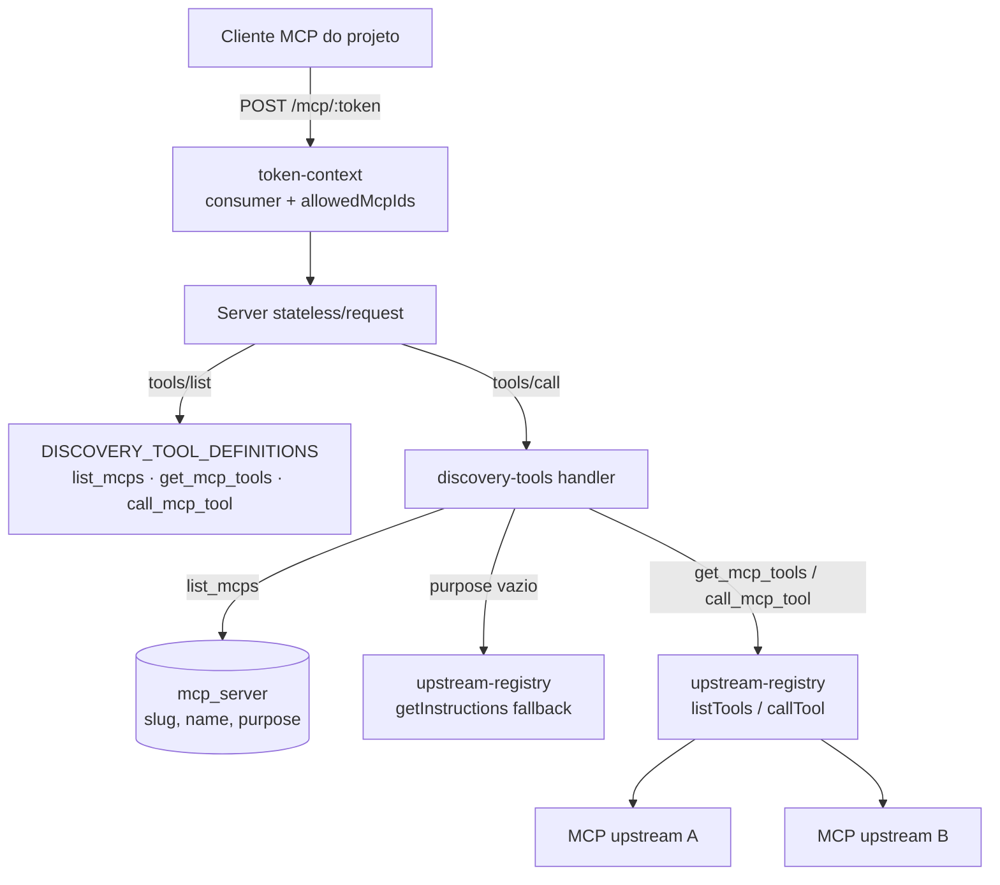

# Gateway Discovery Design

**Spec**: `.specs/features/gateway-discovery/spec.md`
**Status**: Draft

---

## Approach Exploration (Large)

**A — Substituir o tool-aggregator por um módulo `discovery-tools` (RECOMENDADO).** Mantém o padrão atual do codebase (low-level `Server` + `setRequestHandler`, stateless por request); `tools/list` responde uma constante (as 3 meta-tools) e `tools/call` despacha para um handler puro e testável. Menor delta, reusa registry/token-context intactos.

**B — Migrar para a API high-level `McpServer` + `registerTool`.** Mais ergonômica, mas diverge do padrão estabelecido no gateway (AD-011/pattern do MVP), puxa schemas Zod para as definições e obriga re-registrar tools a cada request sem ganho funcional. Rejeitada: custo de mudança sem benefício para 3 tools fixas.

(Uma terceira via — manter achatamento + adicionar meta-tools — já foi descartada pelo usuário no Specify.)

---

## Architecture Overview

O request path do gateway permanece: `POST /mcp/:token` → `createTokenContext` (401/escopo) → `Server` stateless por request. Muda o miolo: em vez de achatar tools dos upstreams, o `Server` expõe 3 meta-tools fixas e o `CallTool` handler despacha para `discovery-tools`.



Escopo: `allowedMcpIds` (ids) chega do token-context; `discovery-tools` resolve os metadados escopados (`id, slug, name, purpose`) numa leitura sanitizada do DB e **só então** mapeia slug→upstream — slug fora desse conjunto nunca toca o registry (DISC-05).

---

## Code Reuse Analysis

### Existing Components to Leverage

| Component | Location | How to Use |
| --------- | -------- | ---------- |
| `createTokenContext` | `src/gateway/token-context.ts` | Inalterado — já resolve consumer + `allowedMcpIds` e 401 (MIG-01) |
| `UpstreamRegistry` | `src/gateway/upstream-registry.ts` | Inalterado — `getClient()` (lazy connect + isolamento), `Client.getInstructions()`/`getServerVersion()` do SDK (verificado: existem no 1.29.0) |
| Padrão Server stateless/request | `src/gateway/gateway-router.ts` | Mantido — só trocam os dois handlers |
| Repositório mcp-servers | `src/domain/mcp-servers/mcp-servers-repository.ts` | Estender com leitura escopada sanitizada + coluna `purpose` |
| Runner de migrations | `src/db/migrate.ts` | Só adicionar `0002_*.sql` — `pnpm build` já copia `*.sql` pro dist (package.json:11) |
| Fixture stdio | `test/fixtures/dummy-stdio-mcp.ts` | Base dos testes de integração; estender para anunciar `instructions` (DESC-02) |
| Padrão de teste unit do aggregator | `src/gateway/tool-aggregator.test.ts` | Mesmo estilo de registry stubado para `discovery-tools.test.ts` |

### Integration Points

| System | Integration Method |
| ------ | ------------------ |
| API REST `/api/mcp-servers` | `purpose` entra no parseCreate/parseUpdate e nas respostas GET |
| UI (`mcp-form.tsx`, `api-types.ts`, `api-client.ts`) | Campo textarea "propósito" no form; tipo `purpose: string \| null` |
| Config writers | **Zero mudança** — entrada gravada (URL+token) idêntica (MIG-01) |

---

## Components

### Migration 0002

- **Purpose**: Coluna nullable `purpose` no `mcp_server`.
- **Location**: `src/db/migrations/0002_add_mcp_server_purpose.sql`
- **Interfaces**: `ALTER TABLE mcp_server ADD COLUMN purpose TEXT;`
- **Reuses**: runner idempotente existente.

### Domain plumbing do `purpose`

- **Purpose**: Persistir/expor `purpose` em create/update/read (DESC-01).
- **Location**: `mcp-server-types.ts`, `mcp-servers-repository.ts`, `mcp-servers-service.ts`, `src/api/mcp-servers-routes.ts`
- **Interfaces**: `McpServerRecord/ListItem.purpose: string | null`; `CreateServerInput.purpose?: string`; `UpdateServerInput.purpose?: string | null` (null limpa); validação: trim, máx. 2000 chars.
- **Reuses**: padrão de update parcial existente (`name`/`url` nullable).

### `discovery-tools` (substitui `tool-aggregator`)

- **Purpose**: Definições + dispatch das 3 meta-tools (DISC-01..07, SEC-10).
- **Location**: `src/gateway/discovery-tools.ts` (novo; `tool-aggregator.ts` e seu teste são removidos — comportamento superseded pelo spec)
- **Interfaces**:
  - `DISCOVERY_TOOL_DEFINITIONS: ToolDef[]` — 3 tools com inputSchema JSON e descriptions que ensinam a IA o fluxo (list → get → call).
  - `handleDiscoveryToolCall(deps, allowedMcpIds, toolName, args): Promise<CallToolResult>` — dispatch puro; tool desconhecida → isError.
  - `deps = { registry: RegistryLike; listScopedMcps(ids: string[]): ScopedMcp[] }` onde `ScopedMcp = {id, slug, name, purpose}` (leitura sanitizada nova no repositório — nunca command/args/url/headers/secrets).
- **Comportamentos**:
  - `list_mcps`: rows escopadas do DB; `purpose` vazio → tenta `registry.getClient(id)` + `getInstructions()` truncado em **400 chars** (fallback `serverVersion.title`), falha → `null` (DISC-07/DESC-02). Resposta = JSON em content text.
  - `get_mcp_tools {mcp}`: slug resolvido **dentro do conjunto escopado**; fora → isError opaco (mesma msg p/ "existe mas não é seu" e "não existe"), sem tocar registry (DISC-05). Dentro → `listTools()` com nomes originais + description + inputSchema (DISC-03).
  - `call_mcp_tool {mcp, tool, arguments?}`: validação de shape (DISC-06) → resolve escopo → `callTool()` proxy verbatim (DISC-04).
  - **Sanitização de erro (SEC-10)**: qualquer falha de connect/chamada upstream vira `isError` com texto fixo `Failed to reach MCP "<slug>"` — nunca a mensagem crua (que pode conter command/paths, ex. `spawn uvx ENOENT`).
- **Reuses**: `RegistryLike` narrow interface (movida do aggregator), isolamento do registry.

### `gateway-router` (handlers trocados)

- **Purpose**: `ListToolsRequestSchema` → `DISCOVERY_TOOL_DEFINITIONS`; `CallToolRequestSchema` → `handleDiscoveryToolCall` (DISC-01).
- **Location**: `src/gateway/gateway-router.ts`
- **Dependencies**: injeta `listScopedMcps` ligada ao `db` de `AppDeps` (mesmo padrão dos serviceDeps atuais).
- **Reuses**: mount, token-context, transporte stateless, tratamento 500 — intactos (MIG-01).

### UI `purpose`

- **Purpose**: Editar/exibir o "pra que serve" (DESC-03).
- **Location**: `web/src/components/mcp-form.tsx` (textarea, placeholder explicando que a IA lê isso), `web/src/api-types.ts`, `web/src/api-client.ts`; exibição resumida em `mcp-server-list.tsx` (discricionário).
- **Reuses**: padrão de campos/cls do form existente (AD-018).

---

## Data Models

```typescript
// mcp_server ganha:
purpose: string | null; // nullable; máx. 2000 chars no write

// Resposta list_mcps (content text JSON):
{ mcps: Array<{ slug: string; name: string; purpose: string | null }> }

// Resposta get_mcp_tools:
{ mcp: string; tools: Array<{ name: string; description?: string; inputSchema?: object }> }
```

---

## Error Handling Strategy

| Error Scenario | Handling | User Impact |
| -------------- | -------- | ----------- |
| Token inválido/disabled | 401 antes de qualquer Server (inalterado) | Cliente não conecta (SEC-02/MIG-01) |
| Slug fora do escopo / inexistente | isError opaco idêntico, sem contato com upstream | IA vê "MCP not available for this consumer" |
| Payload malformado em call_mcp_tool | isError de validação (mensagem diz o campo) | IA corrige e repete (DISC-06) |
| Upstream fora em get/call | isError sanitizado `Failed to reach MCP "<slug>"` | Outros MCPs seguem funcionando (DISC-07) |
| Upstream fora no fallback de purpose | `purpose: null`, MCP ainda listado | list_mcps nunca falha por upstream (DESC-02) |
| Tool inexistente no upstream | Erro do upstream proxiado como tool error | IA vê o erro real do MCP |

Todos os erros de meta-tool são **tool results `isError: true`** (convenção MCP), não erros JSON-RPC — a IA consegue ler e se recuperar.

---

## Risks & Concerns

| Concern | Location | Impact | Mitigation |
| ------- | -------- | ------ | ---------- |
| Testes existentes assertam achatamento | `test/integration/gateway-router.test.ts`, `spike-token-handler-scope.test.ts`, `src/gateway/tool-aggregator.test.ts` | Falharão com o novo protocolo | Reescritos a partir dos novos ACs (superseded por spec, não "afrouxados"); asserts de 401/token preservados verbatim (MIG-01). Verifier confere que a remoção é justificada por AC |
| Mensagem de erro crua vaza command/path | `upstream-client.ts` (spawn errors) | Violaria SEC-10 via gateway | Sanitização central no discovery-tools; teste SEC-10 exercita caminho de erro e varre a resposta |
| Fallback de purpose conecta upstream no list | `discovery-tools.list_mcps` | 1ª chamada lenta com uvx frio | Só quando `purpose` vazio; caches uv/npm em volume já existem; preencher purpose manual elimina o custo |
| Fixture não anuncia instructions | `test/fixtures/dummy-stdio-mcp.ts` | DESC-02 não testável | Estender fixture com `instructions` no construtor do Server |
| Drift de tipos web vs API | `web/src/api-types.ts` | UI quebra silenciosa | Task dedicada atualiza tipos + form juntos |

---

## Tech Decisions (only non-obvious ones)

| Decision | Choice | Rationale |
| -------- | ------ | --------- |
| Erros de meta-tool | Tool result `isError`, não erro de protocolo | Convenção MCP p/ erros de execução; IA lê e se recupera |
| Formato das respostas | JSON serializado em `content: [{type:'text'}]` | Compat máxima entre clientes; schema documentado na description da tool |
| Truncamento do fallback | 400 chars | Evita re-inundar contexto via instructions gigantes (edge case do spec) |
| Mensagem out-of-scope | Idêntica p/ inexistente e fora-de-escopo | Não revela existência de MCPs alheios (DISC-05) |
| `purpose` write bound | trim + máx. 2000 chars | Input bounds do sweep; generoso p/ texto humano |
| Nomes em get_mcp_tools | Originais, sem prefixo | `{mcp, tool}` já desambigua; prefixo era artefato do achatamento |

---

## Fases propostas (para tasks.md)

| Fase | Conteúdo | Modelo sugerido (AD-020) |
| ---- | -------- | ------------------------ |
| F1 | Migration 0002 + domain/API `purpose` + testes | barato (mecânico, padrão existente) |
| F2 | `discovery-tools.ts` + unit tests (core da feature) | forte |
| F3 | Swap no gateway-router + reescrita das integrações + SEC-10 sweep + regressão MIG-01 | forte |
| F4 | UI purpose (form + tipos + lista) | barato/médio |

4 fases → oferta de sub-agents (1 worker/fase, sequencial) + Verifier automático ao final (author ≠ verifier, AD-020).
