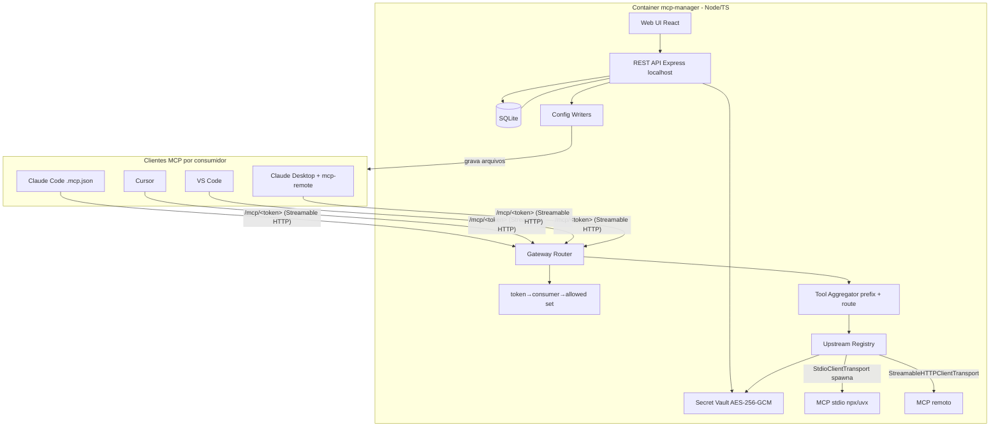

# MCP Gateway Manager — Design

**Spec**: `.specs/features/mcp-gateway-manager/spec.md`
**Status**: Draft
**Abordagem escolhida**: A) construir do zero sobre o SDK MCP oficial (confirmado pelo usuário)

---

## Architecture Overview

Um único processo Node/TS, num container Docker. Três superfícies:

1. **UI web + REST API** (localhost) — cadastro de MCPs, consumidores e atribuições; ações (escrever config, rotacionar token, status, preview).
2. **Gateway MCP** (`/mcp/:token`, Streamable HTTP) — resolve token → consumidor → conjunto de MCPs permitido; agrega tools dos upstreams e faz proxy das chamadas.
3. **Writers de config** — gravam o arquivo nativo de cada cliente apontando pra URL do gateway do consumidor.



**Fluxo de runtime (uma chamada de tool):** cliente do consumidor X conecta em `/mcp/<tokenX>` → middleware valida token e carrega `allowedMcpIds` de X → aggregator lista/serve só as tools desses MCPs (com prefixo `<slug>__tool`) → em `tools/call`, remove o prefixo e roteia pro `Client` do upstream certo no Upstream Registry, que já injetou os secrets decifrados como env.

---

## Code Reuse Analysis

Repo vazio → sem reuso interno. Dependências e padrões externos:

| Fonte | Como usar |
| ----- | --------- |
| `@modelcontextprotocol/sdk` (oficial) | `Client` + `StdioClientTransport`/`StreamableHTTPClientTransport` p/ upstreams; `Server` + `StreamableHTTPServerTransport` p/ o gateway |
| `punkpeye/mcp-proxy` (MIT) | Referência de padrão de agregação stdio↔HTTP (não como dep; estudar a lógica de bridge) |
| `mcp-remote` (npm, geelen/mcp-remote) | Shim escrito no config do Claude Desktop (`npx mcp-remote <url> --header ...`) |
| Node `crypto` (AES-256-GCM) | Secret Vault (sem dep externa) |
| `better-sqlite3` | Driver SQLite síncrono, estável (default seguro sobre `node:sqlite`, que os relatórios divergiram) |
| `ghcr.io/astral-sh/uv` | COPY do binário `uv`/`uvx` pra imagem base `node:22-slim` |

### Integration Points

| Sistema | Método |
| ------- | ------ |
| Clientes MCP (Claude Code/Cursor/VS Code) | Gravar config nativo remoto (`type:http`, `url`, `headers.Authorization`) |
| Claude Desktop (por perfil) | Gravar bloco `mcpServers` com shim `mcp-remote` no `claude_desktop_config.json` do data-dir do perfil |
| Filesystem host | Raiz de workspace montada RW → discovery + escrita de config |

---

## Components

### 1. Config/Env (`src/config/env.ts`)
- **Purpose**: Carregar env (porta, host, raiz de workspace, `MCP_MANAGER_MASTER_KEY`), validar presença da master key.
- **Interfaces**: `loadConfig(): AppConfig`
- **Dependencies**: env vars. **Reuses**: —

### 2. Store / DB (`src/db/`)
- **Purpose**: Conexão SQLite + migrations + repositórios.
- **Location**: `connection.ts`, `migrate.ts`, `migrations/*.sql`
- **Interfaces**: `getDb()`, `runMigrations()`
- **Reuses**: `better-sqlite3`

### 3. Secret Vault (`src/vault/secret-vault.ts`)
- **Purpose**: Cifrar/decifrar secrets de MCP.
- **Interfaces**: `encrypt(plain: string): SealedSecret` (`{iv,tag,ciphertext}` base64) · `decrypt(sealed: SealedSecret): string`
- **Dependencies**: master key (env). **Reuses**: Node `crypto` AES-256-GCM, IV 12 bytes por secret.

### 4. MCP Servers domain (`src/domain/mcp-servers/`)
- **Purpose**: CRUD de MCP servers + seus secrets (cifrados).
- **Interfaces**: `createMcp(input)` · `updateMcp(id, input)` · `deleteMcp(id)` (cascata: remove assignments + reescreve configs afetados) · `listMcps()` (nunca retorna secret em claro; só flag `hasValue`)
- **Reuses**: Secret Vault, Store.

### 5. Consumers domain (`src/domain/consumers/`)
- **Purpose**: Consumidores = `project` (pasta) ou `desktop-profile` (perfil). Token bearer por consumidor + rotação.
- **Interfaces**: `listConsumers()` · `registerManualProject(path)` · `registerDesktopProfile(dataDir, label)` · `rotateToken(consumerId)` · `setClientFormats(consumerId, formats[])`
- **Dependencies**: Discovery, Store. **Reuses**: —

### 6. Workspace Discovery (`src/domain/discovery/workspace-scan.ts`)
- **Purpose**: Escanear subpastas imediatas da raiz montada → projetos descobertos; marcar sumidos como `available=false`.
- **Interfaces**: `scanWorkspace(root): DiscoveredProject[]` · `reconcile()` (merge com registros do store)
- **Reuses**: —

### 7. Assignments domain (`src/domain/assignments/`)
- **Purpose**: Ligar/desligar MCP↔consumidor.
- **Interfaces**: `assign(consumerId, mcpId)` · `unassign(consumerId, mcpId)` · `allowedMcpIds(consumerId): string[]` · `consumersOfMcp(mcpId)`
- **Reuses**: Store.

### 8. Upstream Registry (`src/gateway/upstream-registry.ts` + `upstream-client.ts`)
- **Purpose**: Manter um `Client` MCP conectado por MCP server; lazy-connect; cache; health/status; reconectar.
- **Interfaces**: `getClient(mcpId): Promise<UpstreamClient>` · `listTools(mcpId)` · `callTool(mcpId, name, args)` · `status(mcpId): 'starting'|'running'|'error'|'stopped'` · `restart(mcpId)` · `shutdown(mcpId)`
- **Detalhe**: stdio → `StdioClientTransport({command,args,env})` **spawna o processo** (secrets decifrados injetados em `env`); remoto → `StreamableHTTPClientTransport(url,{headers})`.
- **Dependencies**: SDK MCP, Secret Vault. **Reuses**: SDK transports (gerenciam o child process).

### 9. Tool Aggregator (`src/gateway/tool-aggregator.ts`)
- **Purpose**: Dado `allowedMcpIds`, agregar tools (prefixo `<slug>__<tool>` p/ evitar colisão) e rotear `tools/call` de volta ao upstream, removendo o prefixo.
- **Interfaces**: `aggregateTools(mcpIds): Tool[]` · `route(prefixedName): {mcpId, toolName}`
- **Reuses**: Upstream Registry.

### 10. Gateway Router (`src/gateway/gateway-router.ts` + `token-context.ts`)
- **Purpose**: Endpoint `/mcp/:token` Streamable HTTP. Middleware valida token → carrega consumidor + `allowedMcpIds`; instancia um `Server` MCP por sessão cujos handlers (`ListTools`/`CallTool`) usam o Aggregator escopado.
- **Interfaces**: `mountGateway(app)`
- **Risco/spike**: extrair token no escopo do handler → resolvido via `req.params.token` no middleware antes do transport (ver Risks).
- **Reuses**: SDK `Server`+`StreamableHTTPServerTransport`, Aggregator.

### 11. Config Writers (`src/config-writers/`)
- **Purpose**: Gravar config nativo por cliente, idempotente, sem clobber do resto do arquivo (bloco gerenciado com marcador).
- **Interfaces**: `ConfigWriter.write(consumer, gatewayUrl, token)` · `ConfigWriter.remove(consumer)` — implementações: `claude-code-writer` (`.mcp.json`), `cursor-writer`, `vscode-writer`, `claude-desktop-writer` (shim). `managed-block.ts` faz merge idempotente.
- **Reuses**: —

### 12. REST API (`src/api/*-routes.ts`) + Web UI (`web/`)
- **Purpose**: Express routers (mcp-servers, consumers, assignments, actions) + SPA React/Vite/Tailwind (matriz de atribuição, forms de MCP, status).
- **Interfaces (API principal)**: `POST/GET/PUT/DELETE /api/mcps` · `GET/POST /api/consumers` · `POST /api/consumers/:id/rotate-token` · `POST /api/consumers/:id/assignments` · `POST /api/actions/write-configs` · `GET /api/consumers/:id/preview` (tools agregadas) · `GET /api/mcps/:id/status`
- **Reuses**: domínios acima.

---

## Data Models

```typescript
// SQLite (better-sqlite3). JSON em colunas TEXT.
interface McpServer {
  id: string            // uuid
  slug: string          // único, usado no prefixo de tool
  name: string
  transport: 'stdio' | 'http' | 'sse'
  command?: string      // stdio
  args?: string[]       // stdio (json)
  url?: string          // http/sse
  headers?: Record<string,string> // http/sse (não-secret)
  createdAt: string
}
interface Secret {           // separado p/ nunca sair em claro junto do McpServer
  id: string
  mcpServerId: string
  envKey: string             // ex.: GITHUB_TOKEN
  sealed: { iv: string; tag: string; ciphertext: string } // base64
}
interface Consumer {
  id: string
  type: 'project' | 'desktop-profile'
  name: string
  path: string               // project root  OU  data-dir do perfil Desktop
  token: string              // bearer, único, base64url
  clientFormats: ('claude-code'|'cursor'|'vscode')[] // só p/ type=project
  discovered: boolean        // auto (true) vs manual (false)
  available: boolean         // pasta ainda existe?
  enabled: boolean
  createdAt: string
}
interface Assignment { id: string; consumerId: string; mcpServerId: string; createdAt: string }
```

**Relationships**: `Secret.mcpServerId → McpServer` (1:N, cascata delete); `Assignment` = N:N `Consumer`↔`McpServer` (cascata nos dois lados).

---

## Error Handling Strategy

| Cenário | Tratamento | Impacto ao usuário |
| ------- | ---------- | ------------------ |
| MCP stdio não sobe (comando inválido/secret ausente) | Registry marca `error` c/ última msg; gateway omite as tools dele; demais MCPs seguem | UI mostra MCP em `error`; cliente vê as outras tools |
| MCP remoto inacessível | Timeout no `Client`; status `error`; tools indisponíveis | Idem, sem travar a sessão |
| Token inválido/desconhecido | Middleware responde 401 antes de qualquer tool | Cliente não conecta |
| Colisão de nome de tool entre 2 MCPs | Prefixo `<slug>__` garante unicidade | Tools aparecem prefixadas |
| Gravação de config falha (permissão) em 1 projeto | Writer reporta o projeto que falhou; não aborta os demais | UI lista falha por projeto |
| Reaplicar config sem mudança | `managed-block` compara conteúdo → no-op | Arquivo não muda (idempotente) |
| Restart do container | `runMigrations` + registry lazy reconecta sob demanda a partir do store | Volta a servir sem reconfig manual |
| Secret obrigatório ausente | MCP recusa subir; erro não ecoa o valor | Mensagem clara, sem vazar secret |

---

## Risks & Concerns

| Concern | Local | Impacto | Mitigation |
| ------- | ----- | ------- | ---------- |
| Extrair token no escopo do handler do gateway (sinalizado pela pesquisa) | `gateway/token-context.ts` | Se falhar, escopo por consumidor não funciona | **Spike na 1ª task do gateway**: token vem em `req.params.token`; middleware resolve consumidor+allowed set e injeta no contexto da sessão antes do transport processar |
| Execução de pacotes arbitrários (`npx`/`uvx`) dentro do container | `upstream-client.ts` / Dockerfile | Superfície de RCE se um MCP for malicioso | Postura p/ ferramenta local single-user: rodar como user não-root uid 1000; sem expor gateway fora de localhost por padrão; documentar risco |
| Mount RW macOS (VirtioFS UID/GID) | Dockerfile / compose | Arquivos virando root no host; escrita falhando | `USER appuser` (uid 1000), `COPY --chown`, checagem de permissão no start |
| Driver SQLite divergente nos relatórios | `db/connection.ts` | Escolha errada → build nativo quebrado | Default `better-sqlite3` (maduro); reavaliar `node:sqlite` só se necessário |
| Secrets vazando em log/resposta | Vault, API, Registry | Exposição de credencial | `listMcps` só devolve `hasValue`; nunca logar env decifrado; testes cobrindo isso (SEC-01) |
| SSE legado vs Streamable HTTP | Gateway | Cliente antigo não conecta | Gateway primário Streamable HTTP; fallback SSE só se algum cliente exigir (verificar no Execute) |

---

## Tech Decisions

| Decisão | Escolha | Rationale |
| ------- | ------- | --------- |
| Linguagem/stack | Node 22 + TypeScript | Casa com projetos do usuário + SDK MCP oficial é TS |
| HTTP framework | Express | Padrão dos exemplos do SDK; casa com o padrão de middleware de token da pesquisa |
| Frontend | React + Vite + Tailwind (SPA servida estática pelo Express) | UI de matriz/CRUD; buildada e servida no mesmo processo |
| DB/driver | SQLite via `better-sqlite3` | Estável, síncrono, simples; volume montado |
| Cifra de secrets | Node `crypto` AES-256-GCM, IV por secret, master key via env | Sem dep externa; padrão sólido |
| Runtime dos MCPs stdio | `StdioClientTransport` do SDK (spawna o child) | Elimina supervisor externo; SDK já gerencia |
| Transporte do gateway | Streamable HTTP em `/mcp/:token` | Recomendado atual; nativo em Claude Code/Cursor/VS Code |
| Imagem Docker | `node:22-slim` + `uv` copiado de `ghcr.io/astral-sh/uv` | Node(`npx`)+Python(`uvx`) na mesma imagem |

> Decisões de nível de projeto propagadas p/ `.specs/STATE.md` como AD-011..AD-015.

---

## MVP boundary (P1) no design

Componentes 1–11 + writer **claude-code** + API/UI mínima (CRUD MCP, lista de projetos, matriz, botão write-configs, status básico). Writers cursor/vscode/desktop, status rico e preview = P2/P3 (mesmos componentes, incrementos).
